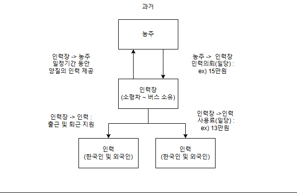
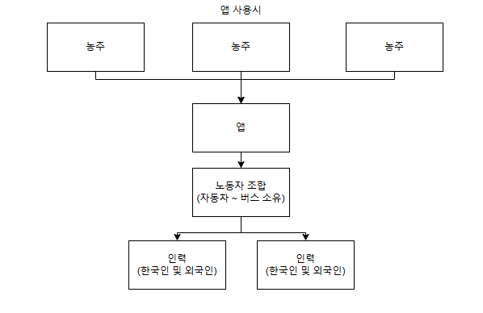

# 일일 농사 노동자 구인·구직 앱

## 개요
**일일 농사 노동자 구인·구직 앱**은 농사 작업에 필요한 인력을 효율적으로 연결하기 위해 설계된 플랫폼  
이 앱은 농장을 운영하는 고용주와 단기 일자리를 찾는 농업 노동자들이 간편하게 서로를 찾고 연결할 수 있도록 지원  
한국의 농사 인력 구조가 변하고있음  
기존에 인력장(한국인)이 인력(한국 및 외국인)을 농지에 데려다 주면서 농사지원을 했다면  
슬슬 한국인인력장 및 인력의 자리가 없어지고 외국인들이 단합하여 한국에서 뭉치고 농사지원을 위한 차를 구매하고 있음  
이 앱은 그 사이를 공략하여 농주가 인력장을 대신해 이 앱으로 신청을하면 외국인의 노동자 조합을 연결하는 앱으로 발전할 예정  

### 돈의 흐름
  

---

## 사용자 요구사항
### 고용주
1. 작업이 필요한 날짜와 작업 종류를 쉽게 게시할 수 있어야 한다.
2. 근무 지역, 작업 시간, 급여를 설정할 수 있어야 한다.
3. 지원자 목록을 확인가능해야함.
4. 지원자 벤 시스템(미정)

### 노동자
1. 자신이 원하는 지역과 작업 종류를 기준으로 일자리를 검색할 수 있어야 한다.
2. 자신의 지원내역을 확인할수 있어야함.
3. 자신의 지급받은 내역을 확인할수있어야함.
4. 자신의 정보를 확인할 수 있어야함.

### 앱 관리자(웹 or 앱 미정)
1. 고용주에게서 입금을 받으면 확인할수 있어야함.
    - 수동 -> 자동
2. 입금 받은 돈을 확인하여 앱 내에서 사용할 수 있는 크레딧으로 변환
3. 1일의 모집인원이 다모였을때 1만원치의 크레딧 차감
4. 고용주가 농주가 맞는지 확인할 수 있는 시스템이 필요함.
5. 노동자 앱에서는 광고로 수입을 창출함.
6. 고용주 앱에서는 광고를 하지않음(수익 : 크레딧)

---

## 솔루션
1. **작업 게시 시스템**  
   - 고용주가 작업 정보를 간단히 작성하고 게시할 수 있는 UI 제공.
   - 지역 기반 필터링 및 태그로 정확한 매칭 지원.

2. **맞춤형 일자리 검색**  
   - 노동자가 지역, 급여, 작업 유형 등의 필터를 적용하여 빠르게 일자리를 검색 가능.
   - 고용주의 평판 및 작업 세부사항 확인 기능 제공.

---

## 주요 기능
### 고용주 기능
- 작업 게시 및 관리
- 지원자 필터링 및 고용 확정
- 노동자 리뷰 작성 및 관리

### 노동자 기능
- 일자리 검색 및 지원
- 지원 상태 확인 및 실시간 업데이트
- 고용주 리뷰 확인 및 작성

---

### 요구 사항
- **모바일 환경**: Android 8.0 이상 또는 iOS 12.0 이상(미정)
- **서버 환경**: Python 3.8 이상, Django/Flask 기반 백엔드(미정)

### 설치
1. 앱 스토어 또는 APK 파일로 다운로드.
2. 앱 설치 후 회원가입 또는 로그인.

### 실행
1. 앱 실행 후 사용자 유형(고용주 또는 노동자) 선택.
2. 사용자 유형에 따라 작업 게시 또는 구직 시작.

---

## 사용 예시

### 고용주
1. 작업 게시:
   - 날짜: `2024-11-22`
   - 작업 종류: `수확`
   - 급여: `100,000원`
2. 지원자를 확인하고 채용 확정.

### 노동자
1. 지역 필터를 적용해 원하는 작업 찾기.
2. 작업 세부정보 확인 후 지원.
3. 채용 확정 후 작업 현장으로 이동.

---

## 파일 구조
📂 1111_project
.
├── app
├── readme_image
├── server
├── server_client
└── 프로젝트_문서
